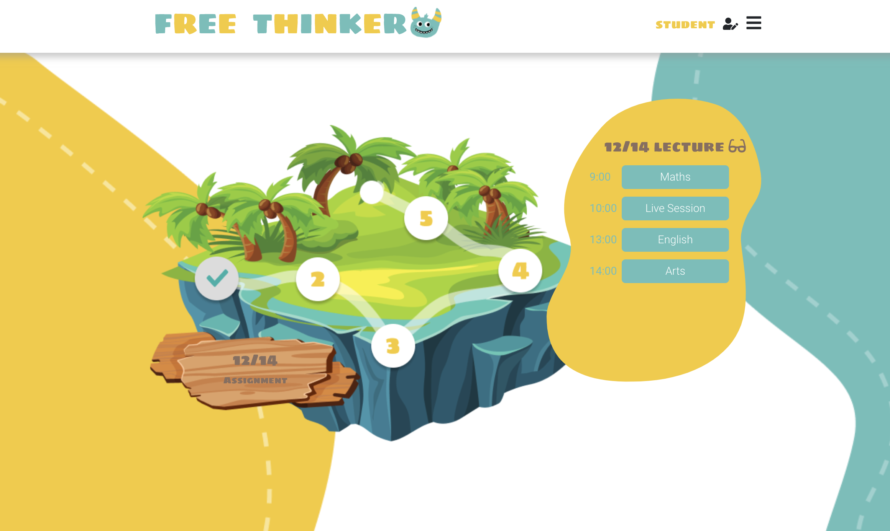

<!--
*** Made with help of Best-README-Template. 
*** See source - > https://github.com/othneildrew/Best-README-Template
-->

<!-- PROJECT LOGO -->
 

  

  <h3 align="center">Free Thinkers</h3>

  

    Primary school at Home !
     
     
     
    <a href="https://free-thinker-d732f.web.app/" target="_blank">View Demo</a>
    ·
    <a href="https://github.com/asad-tirmizi/sda-group-project-gp3/issues">Report Bug</a>
    ·
    <a href="https://github.com/asad-tirmizi/sda-group-project-gp3/issues">Request Feature</a>
  

<!-- TABLE OF CONTENTS -->

  
Table of Contents

  <ol>
    <li>
      <a href="#about-the-project">About The Project</a>
      <ul>
        <li><a href="#built-with">Built With</a></li>
      </ul>
    </li>
    <li>
      <a href="#getting-started">Getting Started</a>
    </li>
    <li>
        <a href="#usage">Usage</a>
        <ul>
          <li><a href="#teachers">Teachers</a></li>
          <li><a href="#students">Students</a></li>
        </ul>
    </li>
    <li><a href="#contributing">Contributing</a></li>
  </ol>

<!-- ABOUT THE PROJECT -->
## About The Project

In those stranges times, our children could not always have possibility to go to school and attend regular class. We believe that kind of learning platform are part of the future of education and must be thought to suits teachers, parents and of course students.

More details:
* The project focus on primary school and aim 6-10 year-old chilren and their teacher.
* At the moment, it is a single-user app: one teacher and his/her class.
* Project is still in development

We are students of Software Development Academy, Novare Potential. We invest a lot on this project and hope you will find it interesting. We are Free, We are Thinkers, **We are Free Thinkers !**

### Built With

* [Java](https://www.java.com)
* [React](https://reactjs.org)
* [Bootstrap](https://getbootstrap.com)

<!-- GETTING STARTED -->
## Getting Started

Feel free to clone this repo and use it as you want.

See dedicated section for installation >> [Help](./Help.md)

<!-- USAGE EXAMPLES -->
## Usage

### Teachers

Create lectures and assignment and get an overview of your preparation.
For the next day or the next week, you can plan in advance.

### Students

Follow your teacher's intructions in a funny environment. Even better than in classroom !

<!-- CONTRIBUTING -->
## Contributing

Want ot help us build a bigger project? Any contributions you make are **greatly appreciated**.

1. Fork the Project
2. Create your Feature Branch (`git checkout -b feature/AmazingFeature`)
3. Commit your Changes (`git commit -m 'Add some AmazingFeature'`)
4. Push to the Branch (`git push origin feature/AmazingFeature`)
5. Open a Pull Request
